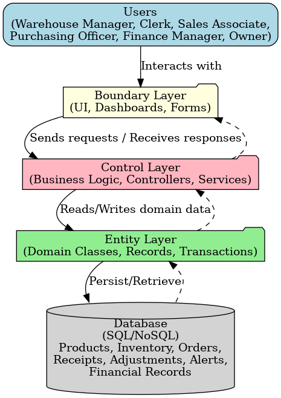

# INVENTRA – Inventory Management System  

A lightweight **inventory management system** built as part of our final year AIML project.  
The system supports **stock control, order tracking, receipts, transfers, adjustments, low-stock alerts, and financial reporting** – everything needed to manage warehouse and store inventory efficiently.  

---

## 📌 Features  

- **Product Management** – Add new products with SKU, category, unit of measure, and description.  
- **Stock Updates** – Adjust inventory levels manually with audit logging.  
- **Order Management** – Create sales orders with automatic stock deduction.  
- **Goods Receipts** – Record incoming items against purchase orders.  
- **Transfers** – Move stock between warehouses/stores.  
- **Adjustments** – Handle damaged or expired stock with admin validation.  
- **Alerts** – Low-stock alerts with acknowledgment.  
- **Reports** –  
  - Current stock levels (CSV export)  
  - Inventory turnover calculation  
  - Financial records (purchases, returns, COGS)  

---

## 🏗️ System Design  

- **User Stories** – Captured warehouse, sales, purchasing, and finance requirements.  
- **Agile Approach** – Product backlog & sprint backlog with use cases.  
- **Analysis Classes** – Entity, boundary, and control classes identified with CRC cards.  
- **Architecture** – Modular structure for extensibility.  

  

---

## 💻 Tech Stack  

- **Frontend:** React + TypeScript  
- **UI Components:** shadcn/ui, TailwindCSS  
- **Icons:** lucide-react  
- **State Management:** React useReducer + localStorage persistence  
- **Build Tool:** Vite (default for React + TS projects)  

---

## 🚀 Getting Started  

Follow these steps to run the project locally:

### 1. Clone the repository
```bash
git clone https://github.com/anks864/FinalYearAIML05.git
cd FinalYearAIML05
```

### 2. Install dependencies
```bash
npm install
```

### 3. Run the development server
```bash
npm run dev
```
Now open [http://localhost:5173](http://localhost:5173) (default Vite port) in your browser.

### 4. Build for production
```bash
npm run build
```

### 5. Preview production build
```bash
npm run preview
```

---

## 👥 Team  

**Team Name:** INVENTRA  
**Course:** CSEN4174 – Software Engineering Lab  
**Team Number:** AIML05  

---

## 📜 License  

This project is licensed under the **MIT License** – feel free to use, modify, and distribute.  

---

✨ Built with passion for **AI/ML + Software Engineering**.  
